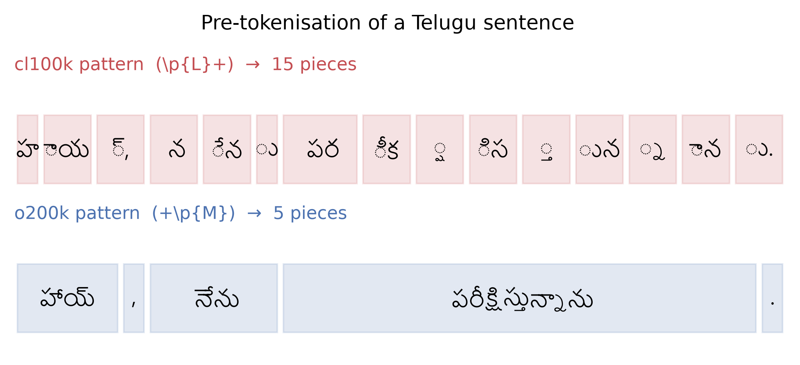

# Combining Marks Matter

Pre-tokenisation halves Telugu token counts at a one-percent cost to Latin scripts.

Code, tokenisers and data pipeline for the paper.
**[Paper (PDF)](paper.pdf)** · Nikhil Raj Mule

---

## The finding

The regular expression that splits text before byte-pair encoding matters more
than it looks. `cl100k_base`, the tokeniser behind GPT-3.5 and GPT-4, matches
letters with `\p{L}+` — a class that **excludes Unicode combining marks**
(`\p{M}`). Telugu writes vowels as combining marks, so every Telugu word is cut
into fragments *before* BPE runs, and no amount of vocabulary budget can undo
the split.



`o200k_base` (GPT-4o) fixed this by adding `\p{M}` to its letter classes. The
change is visible in the public tiktoken source but, as far as we can tell,
was never measured. This repository is that measurement.

## Results

Two byte-level BPE tokenisers, identical vocabulary (48k), corpus, sample and
trainer. Only the pre-tokenisation pattern differs.

| Pattern | EN | DE | TE | Ratio |
|---|---|---|---|---|
| `cl100k_pat` | 4.52 | 4.65 | **1.98** | 2.35 |
| `o200k_pat` | 4.43 | 4.53 | **4.13** | **1.10** |

*Characters per token on held-out text; higher is better. Ratio is worst
language over best — 1.0 would be parity.*

On the full 25.9 GB Telugu corpus this is a **51.8% reduction in token count**.

Two 533M-parameter models were then pre-trained on an identical 9B-token
budget, two seeds each:

| Language | `cl100k_pat` | `o200k_pat` | Change |
|---|---|---|---|
| English | **0.9449** | 0.9534 | +0.9% |
| German | **0.9781** | 0.9879 | +1.0% |
| Telugu | 0.4472 | **0.4225** | **−5.5%** |

*Held-out bits per byte, lower is better. Compare within a language only.*

A clean trade-off: a large Telugu gain for a small cost to the Latin scripts
sharing the vocabulary. Note that halving the token count buys only a 5.5%
improvement in bits-per-byte — the benefit is mostly economic (inference cost,
effective context length) rather than a comparable gain in model quality.

After identical supervised fine-tuning, Telugu extractive QA exact match
improves 45% relative (8.7 → 12.6).

## Repository layout

```
tok/                 trained tokenisers (.model, minbpe format)
figures/             all figures, plus fig1_pieces.json
scripts/
  pull_data.py       stream corpora from HuggingFace
  clean.py           NFC, length, exact-dup, script, MinHash LSH
  tok_ablation.py    train both tokenisers, emit the fertility table
  tokenize_corpus.py encode to uint16 .bin, mix at 40/35/25
  sft.py             supervised fine-tuning, answer-only loss masking
  eval_bpb.py        bits-per-byte on raw held-out text
  eval_qa.py         EM / F1 / HasAns / NoAns / span%
  gen_invoices.py    synthetic German invoice QA generator
  make_figures.py    all figures from results
config/              nanoGPT configs for the four pre-training runs
```

## Reproducing

```bash
pip install numpy regex tiktoken datasets
# torch separately — the CUDA build depends on your GPU:
#   Ada:       pip install torch --index-url https://download.pytorch.org/whl/cu124
#   Blackwell: pip install torch --index-url https://download.pytorch.org/whl/cu128

python scripts/pull_data.py         # ~4-10 h, network bound
python scripts/clean.py             # ~3 h
python scripts/tok_ablation.py      # ~3 h, both tokenisers
python scripts/tokenize_corpus.py   # ~2 h
# pre-training uses nanoGPT: https://github.com/karpathy/nanoGPT
python train.py config/o200k_s0.py  # ~58 h per run on one RTX 5090
python scripts/eval_bpb.py --all
```

All random seeds are fixed: corpus sampling, MinHash permutations, data
interleaving, model initialisation.

## Using the tokenisers

The `.model` files are in minbpe format and load into tiktoken's Rust encoder
for fast inference:

```python
from scripts.eval_bpb import load_tok
enc = load_tok("o200k_pat")
print(len(enc.encode_ordinary("హాయ్, నేను పరీక్షిస్తున్నాను.")))
```

## Data

| | Source | Kept | Size |
|---|---|---|---|
| English | FineWeb-Edu `sample-10BT` | 4,283,307 docs | 19.65 GB |
| German | FineWeb-2 `deu_Latn` | 6,684,898 docs | 20.24 GB |
| Telugu | FineWeb-2 `tel_Telu` + Sangraha + CulturaX + IndicCorpV2 | 4,007,683 docs | 25.89 GB |

Telugu needed four sources to reach a usable size; English and German needed
one each. That asymmetry is itself part of the story.

The synthetic German invoice QA dataset (`gen_invoices.py`) is released with
this repository. It produces invoices in the layouts a PDF text extractor
actually emits, with label variants, distractor fields, and unanswerable
questions.

## Limitations

One abugida. Two seeds. 533M parameters, 9B tokens. The mechanism predicts
the same effect for Devanagari, Bengali, Tamil and Kannada, but we have not
measured it. See the Limitations section of the paper.

## Citation

```bibtex
@misc{mule2026combiningmarks,
  title  = {Combining Marks Matter: Pre-tokenisation Halves Telugu Token
            Counts at a One-Percent Cost to Latin Scripts},
  author = {Mule, Nikhil Raj},
  year   = {2026},
  url    = {https://github.com/nikhilmule/combining-marks-matter}
}
```

## Acknowledgements

Training code follows [nanoGPT](https://github.com/karpathy/nanoGPT).
Telugu data from [AI4Bharat](https://ai4bharat.iitm.ac.in/); English and
German from [FineWeb](https://huggingface.co/datasets/HuggingFaceFW/fineweb)
and FineWeb-2.

## Licence

Code: MIT. Paper: CC BY 4.0. Synthetic invoice data: CC BY 4.0.
